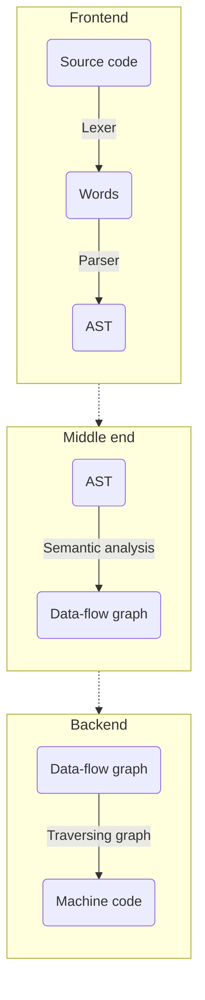

## About
This is a personal hobby-made language written in C++ together with Flex/Bison tools. The goal is to simulate the translation of the programming language into assembly code through the syntax tree and to execute it.



## Some info

### Project goals
 - [X] Fix some minor bugs regarding the assembly code
 - [X] Fix subtraction and shifting
 - [X] Make comments
 - [X] Make error messages verbose
 - [x] Implement if-else statement
 - [X] Implement loop statement
 
### Supported operations and statements
- assignment
- printing 
- arithmetic operations
- logical and bitwise operations
- loop and if-else statements (individually or nested)

## Running the program

First, type
```
make
```
to get a parser.
Until this project gets finished, you can type your program in ``` test.fkc ``` file.
After that, type
```
make com
```
to compile your program into an assembly code, which you can, later on, run by typing:
```
make run
./test
```
Any change made to the ``` test.fkc ``` file requires repeating the previous steps
starting from ```make com``` command.

---

### Example 

```
a := 1;
b := a << 5;

print(b);

if (b < 10) {
    c := b;
}
else {
    c := 10;
};

d := c;

while (d > 0) {
    print(d);
    d := d - 1;
};
```

